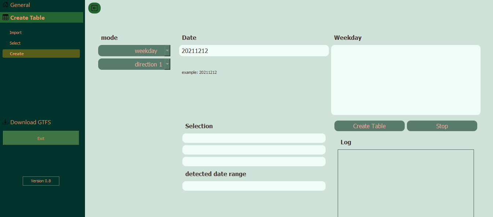

# GTFStoFahrplan

GTFStoFahrplan is a Python script designed to convert GTFS (General Transit Feed Specification) data into Fahrplan-compatible format. Fahrplan is a widely-used transit schedule format primarily used in the German-speaking regions.

## Table of Contents

- [Installation](#installation)
- [Usage](#usage)
- [Contributing](#contributing)
- [License](#license)

## Installation

To install GTFStoFahrplan, you need to have Python installed on your system. You can then install the required dependencies using pip:

```bash
pip install -r requirements.txt
```




Clone this repository to your local machine:

```

git clone https://github.com/Themishau/GTFStoFahrplan.git
```

## Usage

Before using GTFStoFahrplan, make sure you have GTFS data available. GTFS data can be obtained from various public transportation agencies or repositories.

Once you have the GTFS data, you can run the script with the following command:

```

python gtfs_to_fahrplan.py /path/to/gtfs_data

Replace /path/to/gtfs_data with the path to your GTFS data directory.
```

The script will generate Fahrplan-compatible files in the same directory as your GTFS data.

## Contributing

Contributions are welcome! If you'd like to contribute to this project, please follow these steps:

    Fork the repository.
    Create a new branch (git checkout -b feature/improvement).
    Make your changes.
    Commit your changes (git commit -am 'Add new feature').
    Push to the branch (git push origin feature/improvement).
    Create a new Pull Request.

Please make sure to follow the existing coding style and add appropriate documentation for new features or changes.
License

This project is licensed under the MIT License - see the LICENSE file for details.
# auto-py-to-exe

- add add_files
- mainq5.py as script


# Ressources
- VBB - Verkehrsverbund Berlin-Brandenburg GmbH
https://daten.berlin.de/datensaetze/vbb-fahrplandaten-gtfs

- Open Data Portal Metropole Ruhr
https://opendata.ruhr/


Img by <a href="https://de.freepik.com/vektoren/menschen">Menschen Vektor erstellt von pch.vector - de.freepik.com</a>

Icons by Petras Nargela
