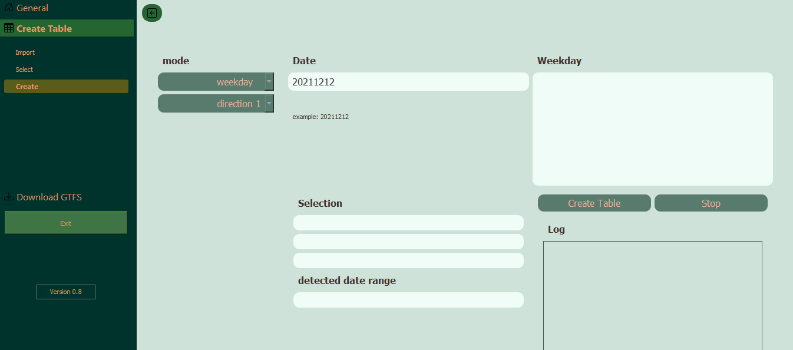

# GTFStoFahrplan

GTFStoFahrplan is a Python script designed to convert GTFS (General Transit Feed Specification) data into Fahrplan-compatible format. Fahrplan is a widely-used transit schedule format primarily used in the German-speaking regions.

## Table of Contents

- [Installation](#installation)
- [Usage](#usage)
- [Contributing](#contributing)
- [License](#license)

## Installation

GTFStoFahrplan requires Windows and Python 3.12 or later. Clone the repository and run the setup batch file from the project directory:

```powershell
git clone https://github.com/Themishau/GTFStoFahrplan.git
cd GTFStoFahrplan
.\setup.bat
```

`setup.bat` creates a local `.venv` virtual environment, updates pip, and installs every dependency from `requirements.txt`. If `.venv` already exists, the script reuses it.

To perform the same setup manually:

```powershell
py -3 -m venv .venv
.\.venv\Scripts\python.exe -m pip install --upgrade pip
.\.venv\Scripts\python.exe -m pip install -r requirements.txt
```

The requirements include the application packages (`duckdb`, `pandas`, `PySide6`, and `requests`), `rarfile` for the standalone helper in `Test/test.py`, and the Windows packaging tools `auto-py-to-exe` and `pyinstaller`. Packages installed as dependencies of these libraries do not need separate entries.



## Usage

Before using GTFStoFahrplan, make sure you have GTFS data available. GTFS data can be obtained from various public transportation agencies or repositories.

Once you have the GTFS data, run the application from the repository root:

```powershell
.\.venv\Scripts\python.exe main.py
```

Use the UI to import a GTFS ZIP and create timetables. Choose an export directory in the application; generated CSV plans are written there.

## Persistent GTFS cache

Select a GTFS CSV ZIP and click **Start Import**. The application calculates a
buffered SHA-256 fingerprint, reuses a compatible cached feed when available, or
imports the required CSV tables into DuckDB in one transaction. Updated content
under the same filename becomes a separate feed. Legacy pickle ZIPs are no longer
opened; import their original GTFS CSV ZIP instead.

The import page includes **Previously loaded GTFS data**, with **Open**, **Delete
selected**, and **Delete all data** buttons. After restarting, the last used feed
is preselected. Opening it works without the original ZIP. Deleting one feed
preserves the other cached feeds. Deleting all data requires confirmation,
recreates the DuckDB cache, and clears the active feed. The storage indicator
shows the current on-disk size of `gtfs.duckdb` and its active write-ahead log in
MB or GB.

Qt's `QStandardPaths.AppLocalDataLocation`, using the organization/application
name `GTFStoFahrplan`, determines the per-user storage root:

```text
<AppLocalDataLocation>/
    data/gtfs.duckdb
    settings/settings.json
    logs/application.log
    temp/
```

Runtime storage is independent of the executable and working directory. Settings
contain versioned preferences, the last feed ID, export directory, and time format.
Malformed settings fall back to defaults; missing feed references are cleared.
Logs rotate automatically. Imports extract one required member at a time into a
temporary directory and clean it on success, failure, or cancellation. Disk space
is needed for the database, the largest decompressed member, and DuckDB spill data.

`model/services/gtfs_cache_service.py` owns the open/import workflow;
`model/infrastructure/database/gtfs_repository.py` owns SQL and transactions.
`CachedGtfsData` implements the planner-facing `GtfsDataSource` contract without
holding GTFS DataFrames. The legacy `InMemoryGtfsData` remains supported. Planners
query trips for the selected route/direction and stop times for the selected trip
IDs, then use existing Pandas calculations and CSV exports. Source frames are
read-only by convention; settings and results belong to each plan. `block_id` is
retained for a future Umlauf algorithm; this change preserves the current vehicle
assignment algorithm.

GTFS times retain their original strings and gain service-day seconds (for example,
`24:15:00` is `87300`). Optional columns are nullable; missing `direction_id` maps
to direction 0 for compatibility, and a single agency without an ID gets a stable
feed-local ID. Either `calendar.txt` or `calendar_dates.txt` is sufficient.

The importer uses DuckDB's [CSV reader](https://duckdb.org/docs/current/data/csv/overview)
with explicit string input types and typed SQL projections. DuckDB defaults here
to two threads and a 512 MB buffer-manager limit with disk spilling; this is not
a cap on total application memory, as described in its
[memory guidance](https://duckdb.org/docs/current/guides/performance/oom).
Selected planning results and the smaller calendar/selection tables still use
Pandas. Further query pushdown and calendar expansion improvements can follow.
Only one application process should write a given cache at a time.

Importer compatibility is centralized in `model/Dto/gtfs_feed.py`.
Increment `CURRENT_GTFS_SCHEMA_VERSION` for changed import semantics; incompatible
feeds remain listed for deletion and require their ZIP to be re-imported. Physical
table changes require a migration at `DATABASE_LAYOUT_VERSION` in
`model/infrastructure/database/schema.py`; unknown database layouts are rejected.
Settings migrations start in `migrate_settings` in `settings_service.py`.

## Validation and EXE packaging

Edit Qt widgets in `view/ui/main_window.ui`, then regenerate the Python module
from the `view` directory. Do not edit the generated file by hand:

```powershell
pyside6-uic .\ui\main_window.ui -o .\pyui\ui_main_window.py
```

The root-level `resource_rc.py` and `resource_boot_rc.py` modules resolve the
resource imports emitted by this command. Custom widget import paths, including
`ProgressHistoryListView`, are defined in the Designer file itself.

Use Python 3.12 or later (the existing UI contains Python 3.12 f-string syntax).
Run the tests with the project interpreter:

```bash
python -m unittest discover -s tests -v
```

Tests use temporary databases and synthetic GTFS ZIPs. They cover a new-process
restart without the ZIP, cache reuse, import rollback, settings, optional columns,
CSV quoting, time conversion, filtered planning, CSV export, and Qt worker/UI
integration. GUI tests run with Qt's offscreen platform.

The setup batch installs the packaging tools together with the runtime
requirements. Run auto-py-to-exe from the repository root with
`ExportConfig.json`, which includes
`--copy-metadata duckdb`. DuckDB reads its installed package version through
`importlib.metadata` during startup, so its distribution metadata must be present
in the frozen application. PyInstaller detects the regular `duckdb` and `_duckdb`
imports without collecting every DuckDB submodule. This is a standard
[PyInstaller metadata option](https://pyinstaller.org/en/stable/usage.html).
For a direct build, use:

```bash
python -m PyInstaller --onefile --copy-metadata duckdb main.py
```

Verify the produced EXE on a clean Windows account by importing, closing,
removing/renaming the original ZIP, reopening the cached feed, and exporting a
plan. Do not bundle a user's DuckDB database or settings into the EXE.

## Contributing

Contributions are welcome! If you'd like to contribute to this project, please follow these steps:

    Fork the repository.
    Create a new branch (git checkout -b feature/improvement).
    Make your changes.
    Commit your changes (git commit -am 'Add new feature').
    Push to the branch (git push origin feature/improvement).
    Create a new Pull Request.

Please make sure to follow the existing coding style and add appropriate documentation for new features or changes.
License

This project is licensed under the MIT License - see the LICENSE file for details.
# auto-py-to-exe

- add add_files
- mainq5.py as script


# Ressources
- VBB - Verkehrsverbund Berlin-Brandenburg GmbH
https://daten.berlin.de/datensaetze/vbb-fahrplandaten-gtfs

- Open Data Portal Metropole Ruhr
https://opendata.ruhr/


Img by <a href="https://de.freepik.com/vektoren/menschen">Menschen Vektor erstellt von pch.vector - de.freepik.com</a>

Icons by Petras Nargela
